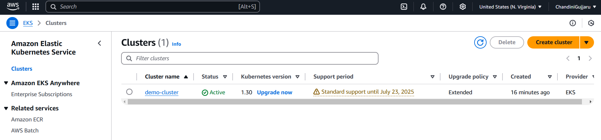
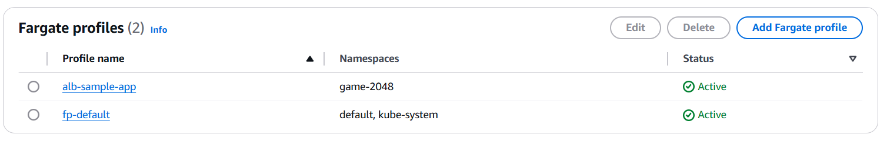
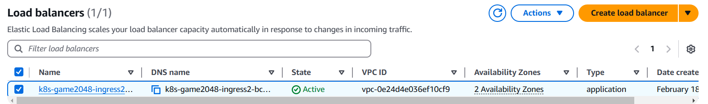
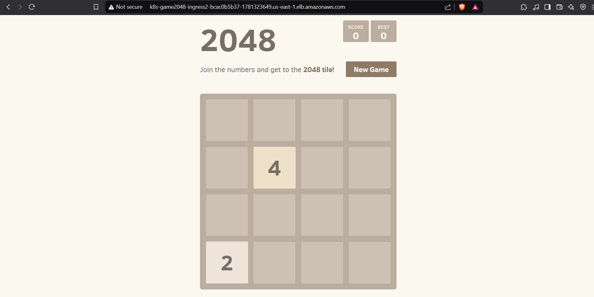
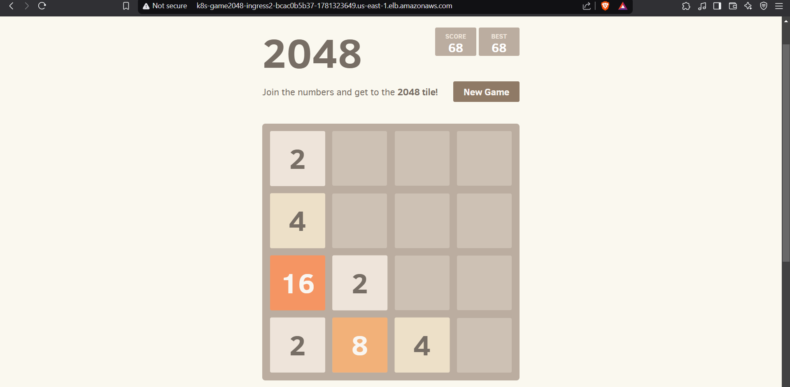

# 🌟 Deploying the 2048 Game App on Amazon EKS with Fargate!

I'm thrilled to share my recent hands-on project where I deployed the 2048 game app on Amazon EKS with AWS Fargate as the compute engine!

## 🔹 Project Breakdown:
1️⃣ Created an EKS Cluster on AWS with Fargate as the compute engine.  
2️⃣ Configured a separate Fargate profile for better workload management.  
3️⃣ Deployed the application by creating Kubernetes Deployment, Service, and Ingress resources.  
4️⃣ Associated IAM OIDC Provider to allow Kubernetes to securely interact with AWS services.  
5️⃣ Created an IAM Policy & IAM Role to grant necessary permissions for load balancing.  
6️⃣ Installed AWS Load Balancer Controller using Helm, enabling integration with ALB.  
7️⃣ Exposed the 2048 game via an Ingress ALB, making it publicly accessible.

## 🔹 Key Takeaways:
💡 Running Kubernetes workloads without managing EC2 instances using AWS Fargate.  
💡 Understanding Fargate profiles and how they control workload placement.  
💡 Configuring OIDC authentication & IAM roles for secure AWS-Kubernetes communication.  
💡 Setting up Ingress with ALB using AWS Load Balancer Controller for traffic routing.

---

## 📸 Screenshots

### ✅ EKS Cluster Created

### ✅ Fargate Profiles Configured

### ✅ AWS Load Balancer Created

### ✅ 2048 Game Running in Browser
  

---
